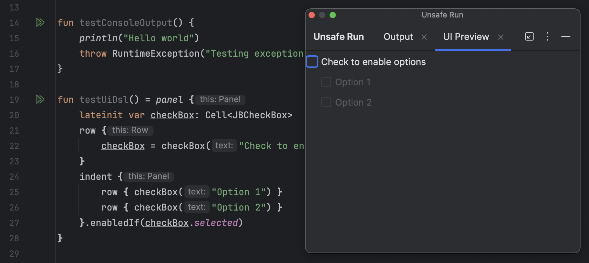

# codesnippets
[**Codesnippets home**](https://github.com/dkimitsa/codesnippets/) -
[**Alt-Pods**](https://github.com/dkimitsa/robovm-robopods) -
[**dkimitsa's dev blog**](https://dkimitsa.github.io/)

## Intellij Idea Plugin -- Unsafe Run kotlin function 

Plugin allows running kotlin function without arguments right from editor.  
Another usage of it is preview of [Kotlin UI DSL](https://plugins.jetbrains.com/docs/intellij/kotlin-ui-dsl-version-2.html) for Intellij Idea plugins. 

Plugin adds Line Marker with double run icon. Hitting one will:
- compile module;
- creates class loader and loads modules class path;
- loads containing class and run function using reflection. 

System.out/System.err is redirected during call and output captured into log panel.
In case function returns AWT component -- it being attached to separate Tab in running panel 

## Prebuild plugin 
[unsafe-run-1.0.0.zip](unsafe-run/build/distributions/unsafe-run-1.0.0.zip)

## Screenshot

